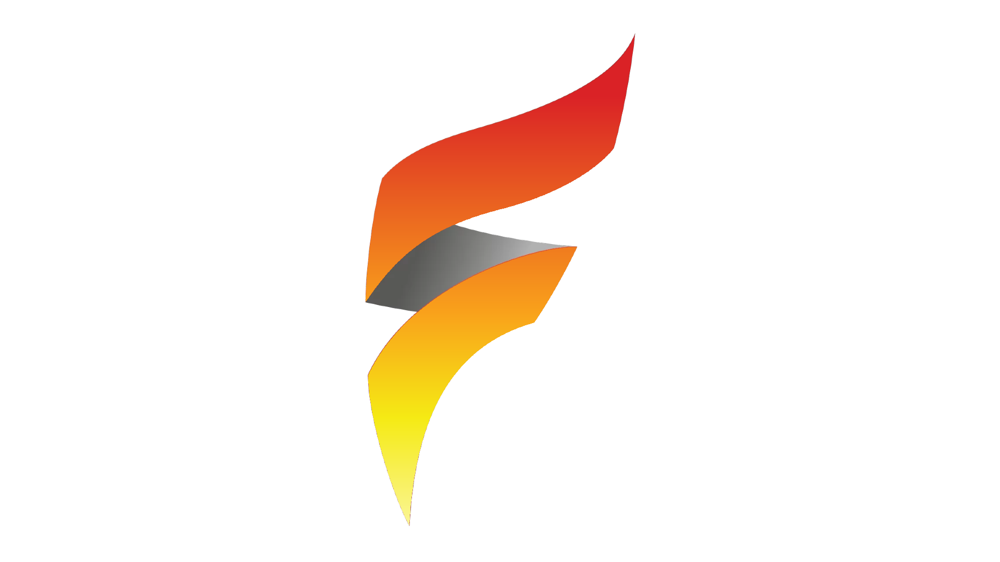

# Firebolt:

## 👋 About

Firebolt is the newest code from Antimatterdev and is as one could call it, the new baseline for the Antimatetrdev line of bots.

## ⌨ Planned Features
- Music Player
- Moderation Tools
- Localization
- Fun Commands

## 📖 Wiki

Our wiki is currently work in progress, please check back later!

## 🤝 Contributing
Contributions, feedback, and bug reports are welcome! Feel free to join my discord to find out what you could do!

Before contributing, we recommend you say hi over in our [Discord server](https://discord.gg/rxtw4PYFqZ)! We can provide support with any issues you may have 🙂

A big thanks to all those who contribute to the project ❤

## 💼 Project Owners 
Here are the owners for this project. They all contribute massively to the running of this project.

- Antimatterdev (Antimatterdev #2557)
- Zur and solar (Owners of exemplify)
- All my beta testers

## 📜 Requirements
These are the requirements for the bot.

- [Python 3.9](https://www.python.org/downloads) (Required packages listed in requirements.txt)
- [LavaLink Server](https://github.com/freyacodes/lavalink) (Java 11 required)

## 💖 Credits
The projects listed in below have provided inspiration, and we thought we'd mention them:

- LavaLink: https://github.com/freyacodes/lavalink
- The exemplify discord server
- My Beta Testers
